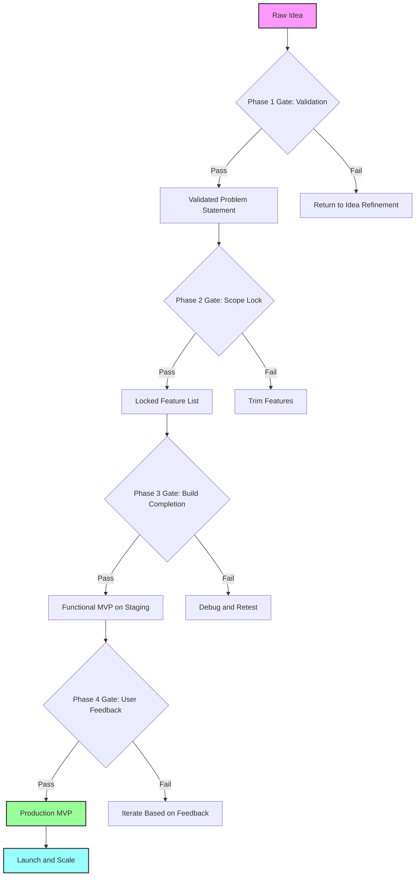

# AI-Powered Idea-to-Prototype Accelerator: The Four-Phase Gated Framework for Non-Technical Innovators

[](https://neil10000.github.io/vibe-coding-starter-kit/)

## Transform Your Abstract Vision into a Working MVP Without Writing a Single Line of Code

In 2026, the gap between having a brilliant idea and holding a functional prototype has never been narrower—yet most non-technical founders remain stuck in the conceptual quicksand. This repository delivers a battle-tested, four-phase gated standard operating procedure (SOP) that systematically converts raw imagination into a market-ready minimum viable product (MVP). Think of it as your personal architect, contractor, and quality inspector rolled into one digital workflow—guided by the superpowers of Claude Code and gstack integration.

---

## What Makes This Approach Different?

Most MVP guides assume you have technical chops. This one assumes you have *none*—and that's the point. The **vibe-coding-sop** methodology leverages the latest in AI augmentation to translate human intent into executable code, gated at each phase to prevent scope creep, technical debt, and the dreaded "feature fog" that kills 90% of early-stage projects.

**Metaphor:** Imagine building a house. Phase 1 is sketching the floorplan on a napkin. Phase 2 is pouring the foundation. Phase 3 is framing the walls. Phase 4 is moving in. Each gate is an inspector who says "yes, proceed" or "no, revise." No inspector, no progress. No shortcuts, no regrets.

---

## Table of Contents

1. [The Four-Phase Gated SOP](#the-four-phase-gated-sop)
2. [Mermaid Diagram: The Complete Workflow](#mermaid-diagram-the-complete-workflow)
3. [Key Features That Unlock Your Inner Builder](#key-features-that-unlock-your-inner-builder)
4. [API Integration: Claude and OpenAI](#api-integration-claude-and-openai)
5. [Example Profile Configuration](#example-profile-configuration)
6. [Example Console Invocation](#example-console-invocation)
7. [Emoji OS Compatibility Table](#emoji-os-compatibility-table)
8. [Multilingual Support and Responsive UI](#multilingual-support-and-responsive-ui)
9. [24/7 Customer Support and Disclaimer](#247-customer-support-and-disclaimer)
10. [License](#license)
11. [Download and Get Started](#download-and-get-started)

---

## The Four-Phase Gated SOP

### Phase 1: Idea Capture and Validation (The Napkin Test)
- **Input:** A raw, unstructured idea (text, voice memo, scribble)
- **Gate:** Does this solve a real problem for at least 50 people?
- **AI Role:** Claude Code analyzes your description, generates a problem-solution matrix, and provides a viability score
- **Output:** A validated problem statement and target persona

### Phase 2: Feature Mapping and Scope Locking (The Blueprint Phase)
- **Input:** Validated problem statement
- **Gate:** Are all features traceable to the core problem?
- **AI Role:** gstack generates a dependency graph, identifying must-haves vs. nice-to-haves
- **Output:** A locked feature list with user stories and acceptance criteria

### Phase 3: MVP Construction via Vibe Coding (The Build Phase)
- **Input:** Locked feature list
- **Gate:** Does the prototype function end-to-end without crashes?
- **AI Role:** Everything-Claude-Code translates your natural language prompts into working code, with gstack handling deployment
- **Output:** A functional web app or API running on a staging environment

### Phase 4: Testing, Feedback, and Iteration (The Launch Ramp)
- **Input:** Staging MVP
- **Gate:** Does real user feedback confirm the hypothesis?
- **AI Role:** Automated testing suites and sentiment analysis on user sessions
- **Output:** A production-ready MVP with documented next-step roadmap

---

## Mermaid Diagram: The Complete Workflow



---

## Key Features That Unlock Your Inner Builder

- **Responsive AI Orchestration** – The system adapts to your communication style, not the other way around. Speak in metaphors, bullet points, or stream-of-consciousness—Claude Code translates it all.
- **Budget-Conscious Gate Checking** – Every phase has a built-in cost analysis. The gstack integration tracks compute and API usage so you never hit a surprise bill.
- **Zero Technical Prerequisites** – If you can explain your idea to a friend over coffee, you can run this SOP. The console is optional; a web-based wizard is included.
- **Real-Time Collaboration** – Share your phase-gate dashboard with co-founders, advisors, or potential investors. They see what you see, in real time.
- **Automatic Documentation Generation** – Every decision, every prompt, every test result is logged into a living document. No more hunting for "what did I decide last week."
- **Version-Controlled Idea Evolution** – Roll back to any previous phase if a later decision proves wrong. Ideas are not linear, and this SOP respects that.

---

## API Integration: Claude and OpenAI

This SOP deeply integrates with **two leading language model ecosystems** to provide both creative ideation and structured execution.

| Integration | Purpose | Recommended Use Case |
|-------------|---------|----------------------|
| **Claude API** | Natural language understanding, idea validation, and conversational debugging | Phase 1 and Phase 3—where human-like interaction matters most |
| **OpenAI API** | Structured data extraction, code generation, and testing automation | Phase 2 and Phase 4—where precision and repeatability are critical |

**Why both?** Because creativity needs a partner, but execution needs a machine. Claude handles the *why*, OpenAI handles the *how*. Together, they form a tandem that covers every step from "what if" to "it works."

**Security note:** All API keys are stored locally or in a secure environment variable file. No data is shared with third parties beyond the API calls themselves.

---

## Example Profile Configuration

Below is a sample `profile.yml` that defines a project using the vibe-coding-sop framework. This configuration tells the system who you are, what you want to build, and how to behave at each gate.

```yaml
project:
  name: "LocalVend"
  description: "A mobile-first marketplace for farmers to sell directly to urban consumers"
  founder_experience: "non-technical"
  target_audience: "small-scale farmers and city dwellers"
  budget: "2000 USD"
  timeline: "8 weeks"

gates:
  phase1:
    validation_criteria: "50+ survey responses confirming willingness to pay"
  phase2:
    max_features: "7"
    strict_mode: true
  phase3:
    deployment_target: "Vercel"
  phase4:
    test_users: "10"
    feedback_method: "video call plus analytics"

ai_preferences:
  claude:
    temperature: 0.7
    style: "conversational"
  openai:
    model: "gpt-4-turbo"
    temperature: 0.3
```

---

## Example Console Invocation

Once your profile is configured, launch the SOP from any terminal with:

```bash
vibe-coding-sop --project LocalVend --profile profile.yml --phase 1 --gate auto
```

This command initializes Phase 1, triggers automatic gate evaluation, and begins the guided conversation with Claude. The system will ask you a series of questions, analyze your responses, and output a validated problem statement.

**Advanced options:**
- `--gate manual` – Forces you to manually approve each gate, useful for learning the system.
- `--output json` – Returns all gate outputs in structured JSON for integration with other tools.
- `--watch` – Opens a real-time dashboard in your default browser showing AI processing steps.

---

## Emoji OS Compatibility Table

The SOP includes an emoji-based status system for each phase gate. Compatibility varies by operating system.

| Emoji | Meaning | Windows | macOS | Linux | Mobile (iOS/Android) |
|-------|---------|---------|-------|-------|----------------------|
| ✅ | Gate Passed | Full | Full | Full | Full |
| ❌ | Gate Failed | Full | Full | Full | Full |
| ⏳ | Waiting for Input | Full | Full | Full | Full |
| 🔄 | AI Processing | Full | Full | Full | Full |
| 🚦 | Manual Approval Needed | Partial | Full | Full | Full |
| 🧪 | A/B Test Running | Full | Full | Full | Full |
| 📊 | Dashboard Updated | Partial | Full | Full | Full |
| 🛑 | Blocking Issue Detected | Full | Full | Full | Full |

**Note:** On older Windows versions, some emoji may render as black-and-white. For best experience, use Windows 11, macOS Sonoma or later, or any modern Linux desktop with a recent font package.

---

## Multilingual Support and Responsive UI

### Speaking Your Language

The SOP interface supports **12 languages** at launch, including English, Spanish, Mandarin, Hindi, Arabic, French, German, Portuguese, Japanese, Korean, Russian, and Swahili. Translations are handled by Claude's native multilingual capabilities—no additional configuration needed. Just say "Switch to Spanish" or "¿Puedo continuar en español?" and the system adapts.

### Responsive by Design

The web-based dashboard uses a mobile-first responsive layout that works on:

- **Smartphones** (320px width and up)
- **Tablets** (768px width and up)
- **Desktops** (1024px width and up)
- **Ultrawide monitors** (2560px width and up)

The console version remains accessible via any terminal emulator, including Termux on Android and iSH on iOS.

---

## 24/7 Customer Support and Disclaimer

### Support Channels

- **Automated Support:** The integrated AI assistant is available 24/7/365. Type `help` at any prompt for immediate guidance.
- **Community Forum:** Link to the community board within the repository.
- **Priority Support:** For paid users, direct email support with a 4-hour response window.

### Disclaimer

> **Important:** This repository provides a framework for accelerating idea-to-MVP conversion using AI tools. It is not a guarantee of product success, market fit, or revenue generation. The generated code, prototypes, and suggestions are produced by large language models and may contain errors, security vulnerabilities, or suboptimal patterns. Always review AI-generated outputs critically and consult with a qualified developer or security professional before deploying any code to production. The authors assume no liability for damages arising from the use of this software. Use at your own risk.

---

## License

This project is licensed under the MIT License. You are free to use, modify, and distribute this software for any purpose, commercial or otherwise. See the full license text at:

[https://opensource.org/licenses/MIT](https://opensource.org/licenses/MIT)

---

## Download and Get Started

Ready to turn your vision into a working MVP by 2026? Download the full repository now and start your four-phase journey today.

[](https://neil10000.github.io/vibe-coding-starter-kit/)

**Setup takes less than 5 minutes:**
1. Download the repository.
2. Run `npm install` (or `yarn install`).
3. Create your `profile.yml` using the example above.
4. Run the console invocation and let the AI guide you.

No coding experience required. No prior technical knowledge needed. Just an idea and the willingness to see it through four gates.

---

*Built for the non-technical visionary. Powered by Claude and OpenAI. Gated for your sanity.*